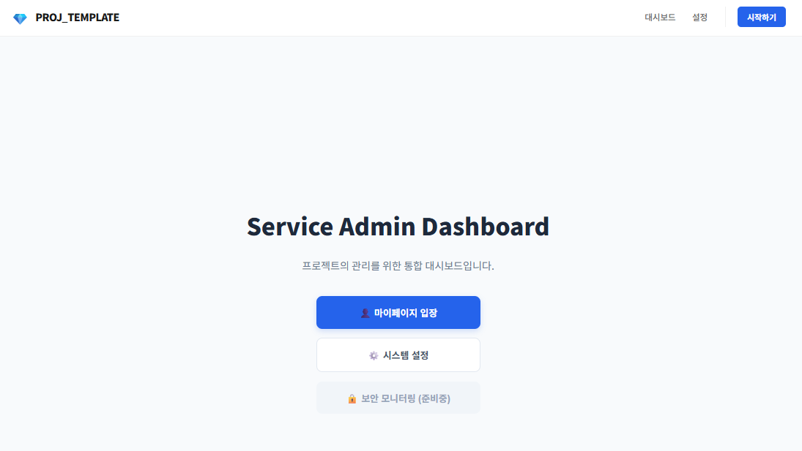
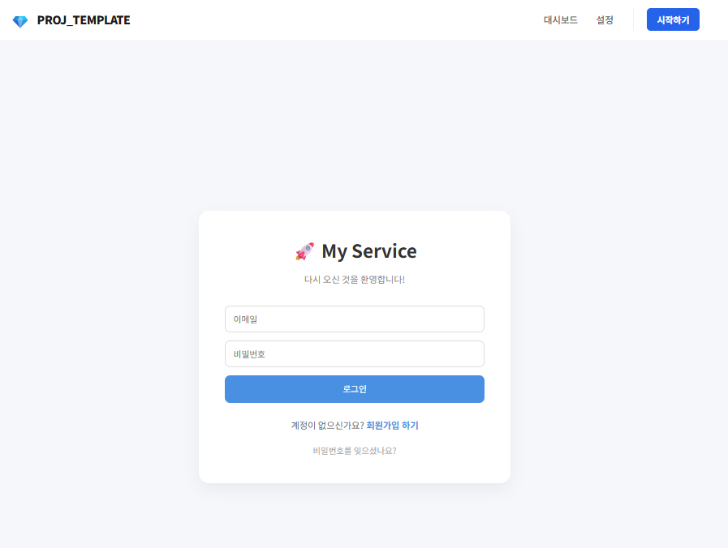
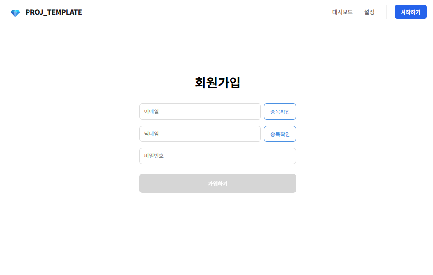
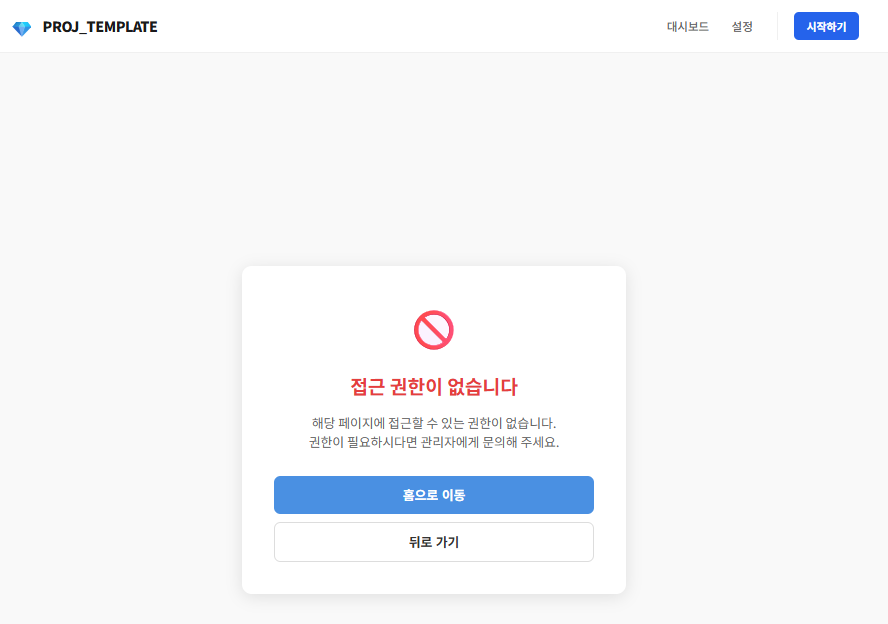

# 🚀 React + Spring Boot Auth Boilerplate (FSD Architecture)

이 프로젝트는 Feature-Sliced Design (FSD) 아키텍처를 적용한 React 템플릿입니다. 별도의 .env 설정 없이 `npm install` 만으로 즉시 개발 및 Spring Boot 연동이 가능합니다.

---

## 📱 Preview

<p align="center">
  
  
</p>
<p align="center">
  
  
</p>

---

## 🛠 Tech Stack
- **Framework**: React 22 (Vite)
- **Language**: TypeScript
- **Auth**: Axios Interceptors (JWT Access/Refresh)
- **Architecture**: Feature-Sliced Design (FSD)

---

## 📂 Key Configurations & Rules

### 1. Absolute Path (@/*)
- `vite.config.ts`와 `tsconfig.json` 설정에 따라 `@/`를 통해 `src` 폴더에 접근합니다.
- **Barrel Export 규칙**: 각 폴더의 `index.ts`에서 내부 요소를 export 해야 외부에서 `@/`로 참조 가능합니다.

### 2. API Proxy & Path Simplified
- **자동 경로 매핑**: `apiInstance`의 `baseURL`이 `/api`로 설정되어 있으며, Vite Proxy가 이를 가로채 백엔드(`localhost:8080`)로 전달합니다.
- **주의사항**: 백엔드 컨트롤러에 `/api`를 중복 작성하지 마세요. 프론트의 `/auth/login`은 백엔드의 `http://localhost:8080/auth/login`으로 자동 연결됩니다.

---

## 🏗 FSD Layer & API Structure

### 1. Entities 레이어 구조 (src/entities/[name]/)
엔티티는 데이터 중심의 최소 단위이며 아래와 같은 하위 구조를 가집니다.
- `model/`: 해당 도메인의 순수 데이터 인터페이스 정의 (`types.ts`)
- `ui/`: 데이터를 받아 렌더링하는 최소 단위 UI (`ProfileCard.tsx` 등)
- `api/`: 해당 엔티티와 관련된 데이터 요청 로직
- `index.ts`: 외부에서 사용할 요소들을 통합 export 하는 관문

### 2. API 데이터 정의 규칙 (Spring DTO 매핑)
Spring Boot 응답 형식은 `shared/model/types.ts`의 `ApiResponse<T>`를 표준으로 사용합니다.

**[구현 예시]**

* **공통 응답 형식 (Shared):**
    ```typescript
    export interface ApiResponse<T> { success: boolean; message: string; data: T; }
    ```

* **기능별 응답 정의 (Features):**
    ```typescript
    import type { ApiResponse } from '@/shared';
    export interface LoginResponseData { accessToken: string; nickname: string; }
    export type LoginResponse = ApiResponse<LoginResponseData>; // 제네릭 주입
    ```
    
* **기본형 응답:**
    ```typescript
    export type CheckEmailResponse = ApiResponse<boolean>; // boolean, int 등 직접 주입
    ```

---

## ✨ Auth & Security Flow
- **Axios Interceptor**: 모든 요청에 `accessToken` 자동 주입 및 401 에러 시 `/auth/reissue` 자동 호출.
- **Security Routes**: `PrivateLayout` 내부의 경로는 인증(Login)이 필수입니다.
- **403 Forbidden**: 로그인 상태이나 권한이 없는 경우 `UnauthorizedPage`로 이동하며, 인터셉터가 이를 처리합니다.

---

## 🏗 컴포넌트 구현 규칙 (Composition)
1. **Entity Card**: 단일 데이터를 그리는 최소 UI (`entities/name/ui/Card.tsx`)
2. **Widget List**: 엔티티 카드를 가져와 그리드나 리스트로 배치 (`widgets/name/ui/List.tsx`)
3. **Page**: 위젯을 최종 배치하여 서비스 페이지 완성

---

## 🚀 Getting Started
1. Installation: npm install

2. Development: npm run dev

---

## 🔗 Connection Info
- Frontend: http://localhost:5173
- Backend API: http://localhost:8080 (Vite Proxy가 /api 경로를 처리)

---

<br>

## 🐳 Development with Docker (Optional)

Node.js를 직접 설치하지 않고 컨테이너 환경에서 개발할 수 있습니다. 
**단, 백엔드(Spring Boot)가 로컬 호스트에서 실행 중인 경우** 아래 설정을 반드시 확인해야 합니다.

### 1. Connection Setting (중요)
Docker 컨테이너 내부의 프론트엔드가 로컬의 백엔드(`localhost:8080`)에 접근하려면 프록시 대상을 수정해야 합니다.

- **방법 A: vite.config.ts 수정**
  `target` 주소를 `localhost`에서 `host.docker.internal`로 변경합니다.
    ```typescript
    // vite.config.ts
    proxy: {
      '/api': {
        target: '[http://host.docker.internal:8080](http://host.docker.internal:8080)', // localhost 대신 사용
        changeOrigin: true,
      }
    }
    ```

### 2. Execution

    # 개발 모드로 컨테이너 실행 (Hot Reloading 지원)
    $ docker-compose up

---

## 📝 License

This project is licensed under the **MIT License** - see the [LICENSE](LICENSE) file for details.

[](https://opensource.org/licenses/MIT)